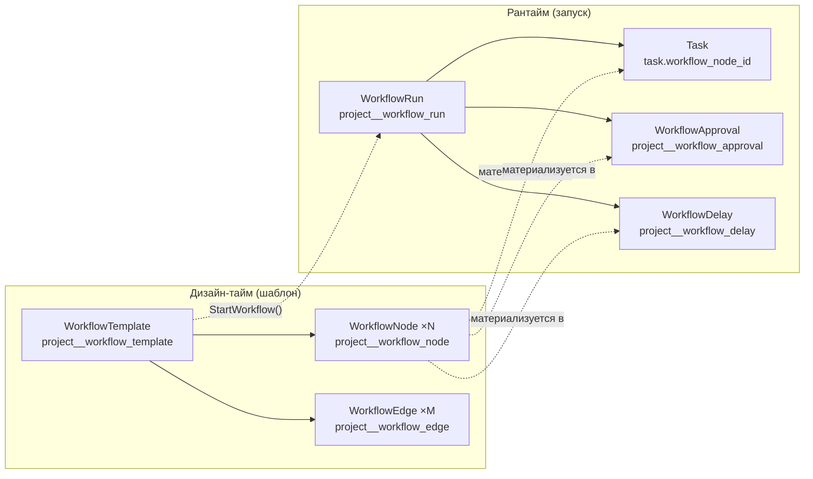
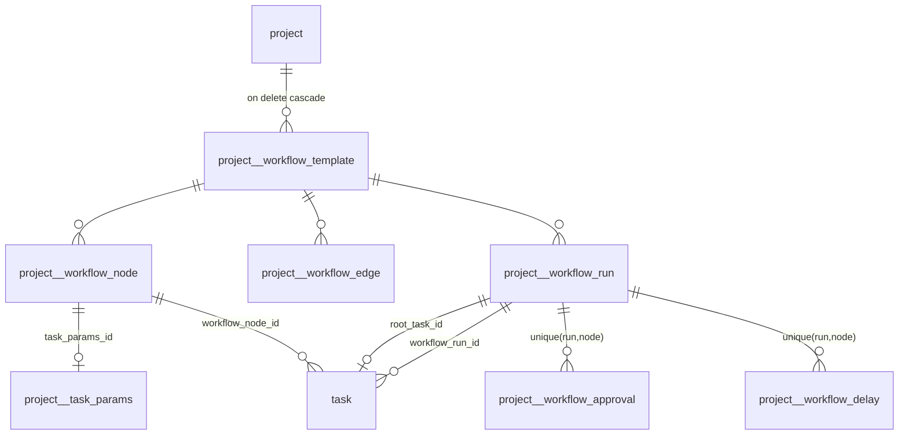
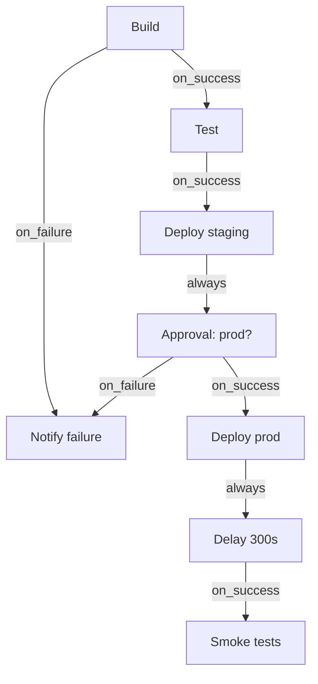
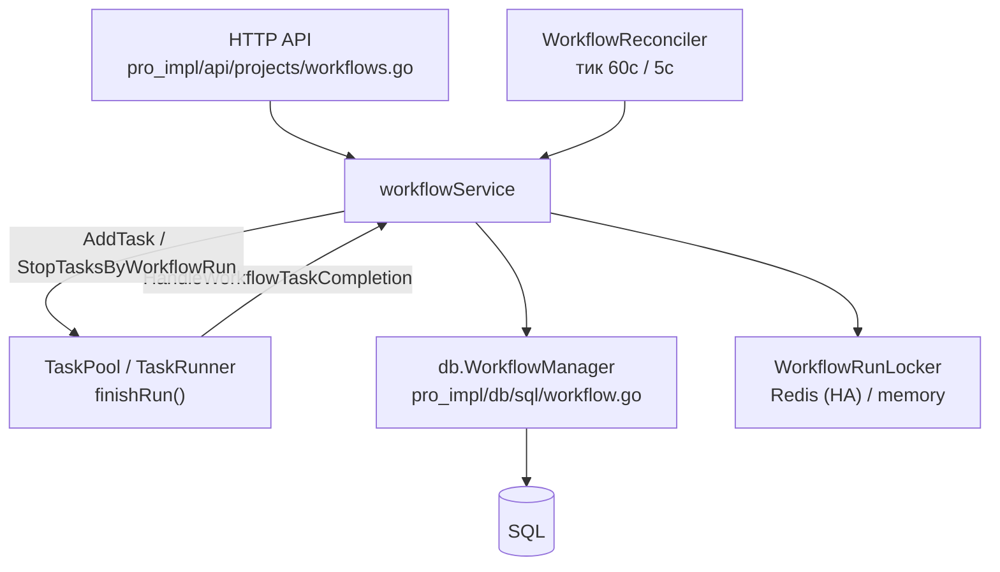
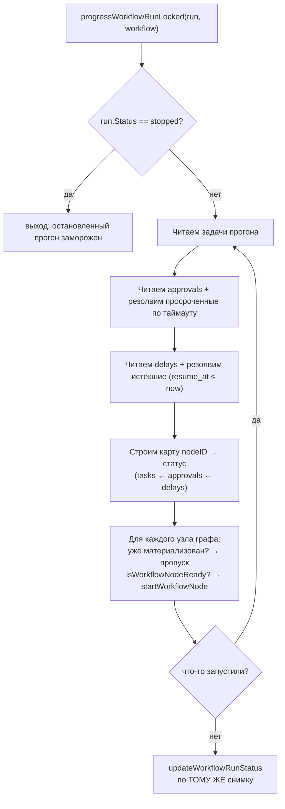
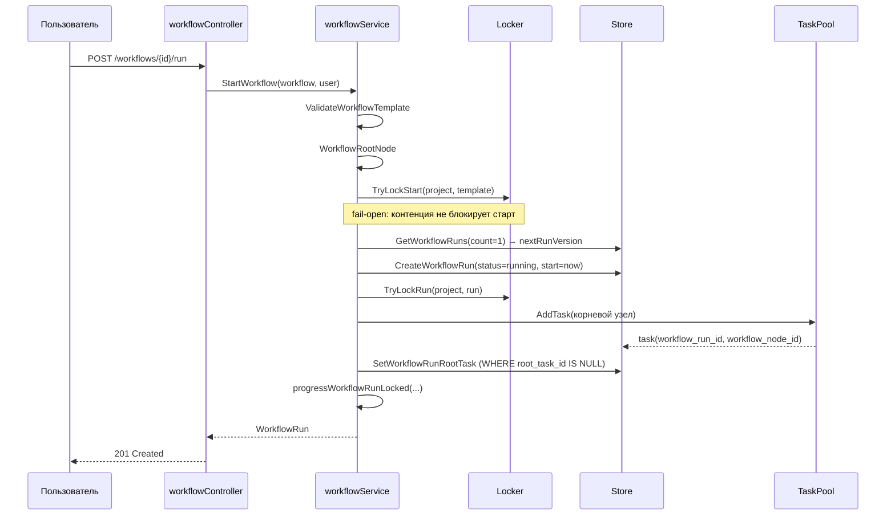
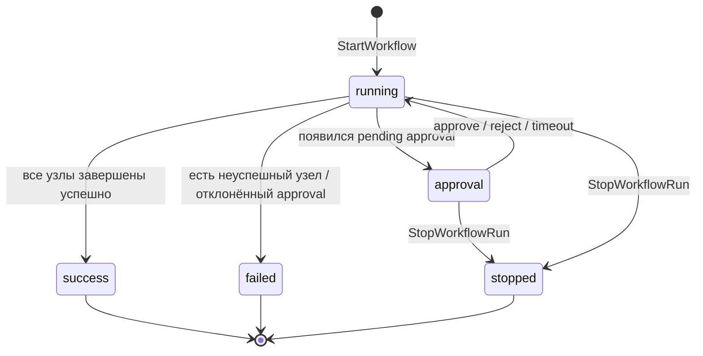
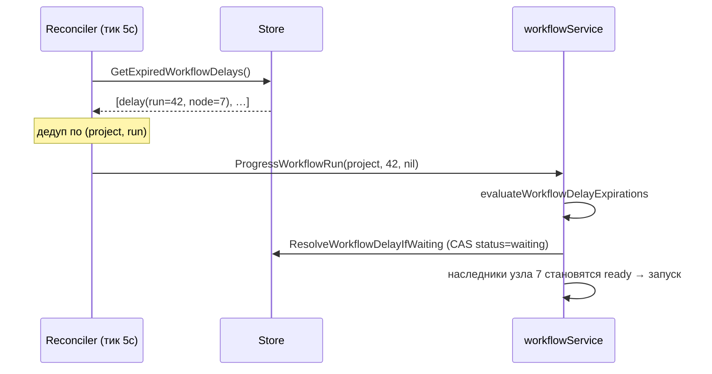
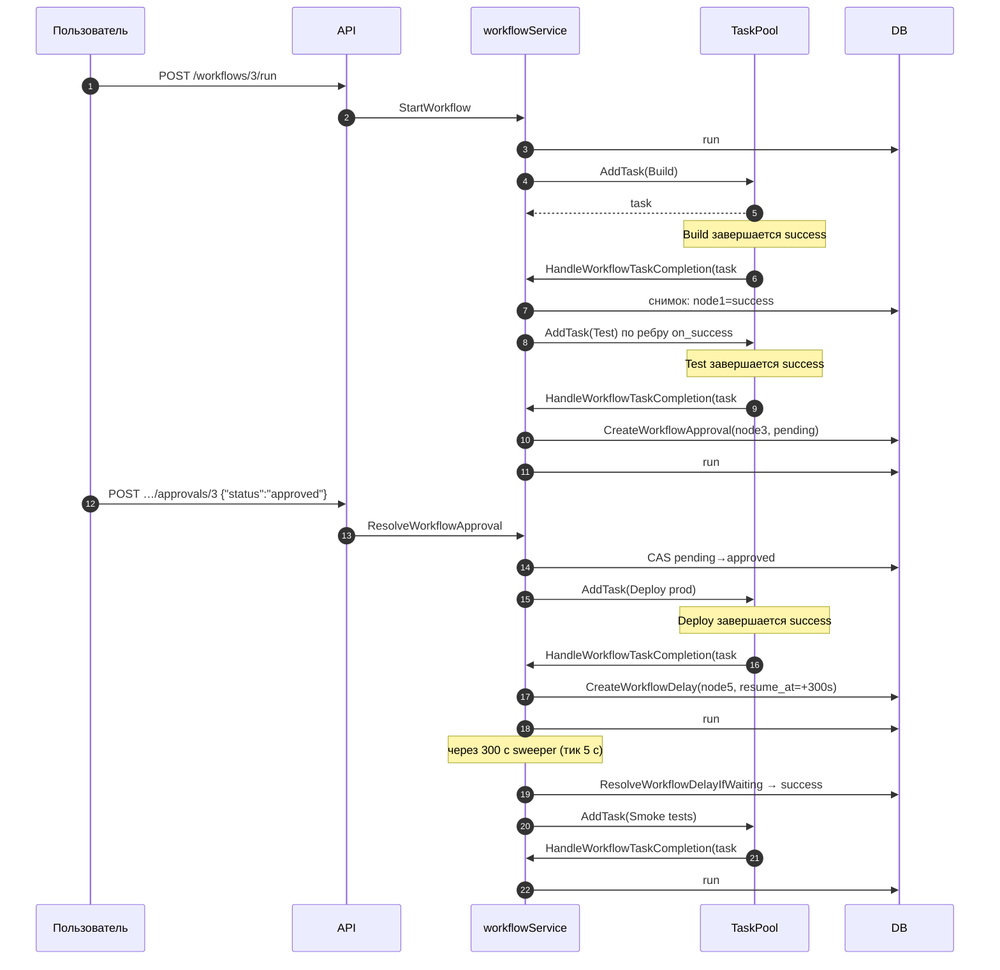

# Workflows в Semaphore UI

Подробное описание подсистемы workflow (графов задач): модель данных, движок
исполнения, HTTP API, UI, HA-поведение и точки расширения — с примерами из кода.

> **Лицензирование.** Workflows — Pro-фича. В открытой сборке
> (`pro/…`) все точки входа — заглушки-no-op, реальная реализация лежит в
> модуле `pro_impl/…`, подключаемом через [go.work](go.work). Флаг фичи —
> `Workflows` в [pro_interfaces/featues.go](pro_interfaces/featues.go).

---

## 1. Что это такое

**Workflow** — это ориентированный ациклический граф (DAG) узлов, который
описывает многошаговый сценарий: запустить один шаблон задачи, дождаться
результата, в зависимости от успеха/неудачи запустить следующие, спросить
подтверждение у человека, подождать заданное время и т. д.

Две сущности верхнего уровня:

| Сущность | Тип Go | Таблица | Смысл |
|---|---|---|---|
| Шаблон workflow | `db.WorkflowTemplate` | `project__workflow_template` | Сам граф: узлы + рёбра. Редактируется в UI. |
| Запуск workflow | `db.WorkflowRun` | `project__workflow_run` | Один конкретный прогон шаблона со статусом и версией. |

Каждый исполняемый узел в рамках запуска материализуется в одну из трёх
рантайм-сущностей: **задача** (`task`, строка в общей таблице `task` с
проставленными `workflow_run_id`/`workflow_node_id`), **подтверждение**
(`project__workflow_approval`) или **задержка** (`project__workflow_delay`).



---

## 2. Модель данных

Все типы объявлены в [db/Workflow.go](db/Workflow.go) — файл лежит в открытом
модуле намеренно: структуры нужны и открытому коду (task pool, backup), и
Pro-реализации.

### 2.1 Шаблон, узел, ребро

```go
// db/Workflow.go
type WorkflowTemplate struct {
	ID           int
	ProjectID    int
	Name         string
	Description  *string
	StartVersion *string        // база для версионирования запусков

	Nodes []WorkflowNode        // db:"-" — грузятся отдельным запросом
	Edges []WorkflowEdge

	LastRun *WorkflowRun        // последний запуск, для списка в UI
}

type WorkflowNode struct {
	ID                 int
	WorkflowTemplateID int

	TemplateID      int                     // для kind=task
	Kind            WorkflowNodeKind        // task | approval | note | delay
	ConvergenceMode WorkflowConvergenceMode // all | any

	ApprovalTimeout *int                    // для kind=approval, секунды
	ApprovalMessage *string

	TaskParamsID *int                       // для kind=task
	TaskParams   *TaskParams                // окружение, inventory, git branch, params…

	Note         *string                    // для kind=note
	DelaySeconds *int                       // для kind=delay

	PositionX int                           // координаты на канвасе редактора
	PositionY int
}

type WorkflowEdge struct {
	ID                 int
	WorkflowTemplateID int
	SourceNodeID       int
	DestinationNodeID  int
	Condition          WorkflowEdgeCondition // on_success | on_failure | always
}
```

### 2.2 Перечисления

```go
// Условие перехода по ребру
WorkflowEdgeOnSuccess = "on_success"
WorkflowEdgeOnFailure = "on_failure"
WorkflowEdgeAlways    = "always"

// Тип узла
WorkflowNodeTaskKind     = "task"
WorkflowNodeApprovalKind = "approval"
WorkflowNodeNoteKind     = "note"
WorkflowNodeDelayKind    = "delay"

// Режим схождения (что делать, когда в узел входит несколько рёбер)
WorkflowConvergenceAll = "all"
WorkflowConvergenceAny = "any"

// Статус запуска
WorkflowRunRunning  = "running"
WorkflowRunApproval = "approval"
WorkflowRunSuccess  = "success"
WorkflowRunStopped  = "stopped"
WorkflowRunFailed   = "failed"
```

Пустые значения трактуются как значения по умолчанию — это важно для обратной
совместимости со старыми записями:

```go
// db/Workflow.go
func (node WorkflowNode) EffectiveKind() WorkflowNodeKind {
	if node.Kind == "" {
		return WorkflowNodeTaskKind
	}
	return node.Kind
}

func (node WorkflowNode) EffectiveConvergenceMode() WorkflowConvergenceMode {
	if node.ConvergenceMode == "" {
		return WorkflowConvergenceAll
	}
	return node.ConvergenceMode
}
```

### 2.3 Схема БД

Миграции (SQLite-диалект, транслируется в MySQL/Postgres):

| Миграция | Что добавляет |
|---|---|
| [db/sql/migrations/v2.18.15.sql](db/sql/migrations/v2.18.15.sql) | Все базовые таблицы: `project__workflow_template`, `…_node`, `…_edge`, `…_run`, `…_approval`; колонки `task.workflow_run_id`, `task.workflow_node_id`, `task.artifacts` |
| [db/sql/migrations/v2.19.11.sql](db/sql/migrations/v2.19.11.sql) + [db/sql/migration_2_19_11.go](db/sql/migration_2_19_11.go) | `project__workflow_node.task_params_id` — параметры задачи узла переезжают в общую таблицу `project__task_params` (старые `inventory_id`/`environment_id`/`limit` остаются как legacy-колонки) |
| [db/sql/migrations/v2.20.2.sql](db/sql/migrations/v2.20.2.sql) | `project__workflow_node.delay_seconds` и таблица `project__workflow_delay` |



Два уникальных индекса критичны для корректности в HA-режиме — они физически
запрещают создать два подтверждения или две задержки для одной пары
(запуск, узел):

```sql
create unique index `project__workflow_approval__run_node`
  on `project__workflow_approval`(`workflow_run_id`, `workflow_node_id`);

-- в project__workflow_delay
unique (`workflow_run_id`, `workflow_node_id`)
```

Плюс индекс для «сборщика» просроченных задержек:

```sql
create index `project__workflow_delay__status_resume_at`
  on `project__workflow_delay`(`status`, `resume_at`);
```

---

## 3. Типы узлов

### 3.1 `task` — запуск шаблона задачи

Ссылается на обычный `db.Template` через `TemplateID`. Опционально несёт
`TaskParams` — те же параметры, что задаются при ручном запуске задачи
(окружение, inventory, ветка, версия, произвольные params).

Запуск узла — это создание обычной задачи Semaphore, просто помеченной
принадлежностью к запуску workflow:

```go
// pro_impl/services/server/workflow_svc.go — startWorkflowNode
case db.WorkflowNodeTaskKind:
	tpl, err := s.templateReceiver.GetTemplate(run.ProjectID, node.TemplateID)
	...
	var task db.Task
	if node.TaskParams != nil {
		task = node.TaskParams.CreateTask(node.TemplateID)
	} else {
		task = db.Task{TemplateID: node.TemplateID}
	}
	task.ProjectID = run.ProjectID
	task.BuildTaskID = buildTaskID
	task.WorkflowRunID = &run.ID
	task.WorkflowNodeID = &node.ID
	if run.Version != nil {
		task.Version = run.Version   // версия запуска перебивает версию из TaskParams
	}

	newTask, err := s.enqueuer.AddTask(task, userID, username, run.ProjectID, tpl.App.NeedTaskAlias())
```

### 3.2 `approval` — ожидание решения человека

Создаёт строку в `project__workflow_approval` со статусом `pending`. Ждать
может неограниченно долго либо до `ApprovalTimeout` секунд, после чего
автоматически отклоняется. Ожидание не держит горутину — это строка в БД.

### 3.3 `delay` — пауза

Создаёт строку в `project__workflow_delay` со статусом `waiting` и полем
`resume_at = now + delay_seconds`. Тоже не спит в памяти:

```go
// pro_impl/services/server/workflow_svc.go
case db.WorkflowNodeDelayKind:
	// Mirrors the approval branch: the wait is a persisted row, not an
	// in-memory sleep, so it survives a restart and is resolvable from any
	// node of the cluster.
	...
	now := s.now()
	_, err = s.workflowRepo.CreateWorkflowDelay(db.WorkflowDelay{
		ProjectID:      run.ProjectID,
		WorkflowRunID:  run.ID,
		WorkflowNodeID: node.ID,
		Status:         db.WorkflowDelayWaiting,
		ResumeAt:       now.Add(time.Duration(*node.DelaySeconds) * time.Second),
		Created:        now,
	})
```

### 3.4 `note` — заметка на канвасе

Чистая аннотация. Не исполняется, не участвует в графе исполнения, ей запрещено
иметь рёбра, и она не считается корнем при валидации:

```go
// pro_impl/services/server/workflow_svc.go — progressWorkflowRunLocked
if node.EffectiveKind() == db.WorkflowNodeNoteKind {
	// Note nodes never execute and are not part of the run graph.
	continue
}
```

### 3.5 Сводная таблица

| Kind | Что создаёт при старте | Обязательные поля | Терминальные статусы |
|---|---|---|---|
| `task` | `db.Task` через task pool | `template_id` | `success` / `error` / `stopped` |
| `approval` | `WorkflowApproval` (`pending`) | — (опц. `approval_timeout`, `approval_message`) | `approved` / `rejected` |
| `delay` | `WorkflowDelay` (`waiting`) | `delay_seconds > 0` | `success` / `stopped` |
| `note` | ничего | `note` | — |

---

## 4. Рёбра, условия и схождение

### 4.1 Условие ребра

Ребро «срабатывает», если статус исходного узла удовлетворяет условию:

```go
// pro_impl/db/Workflow.go
func WorkflowConditionMatches(status task_logger.TaskStatus, condition coreDB.WorkflowEdgeCondition) bool {
	switch condition {
	case coreDB.WorkflowEdgeOnSuccess:
		return status == task_logger.TaskSuccessStatus
	case coreDB.WorkflowEdgeOnFailure:
		return status.IsFinished() && status != task_logger.TaskSuccessStatus
	case coreDB.WorkflowEdgeAlways:
		return status.IsFinished()
	default:
		return false
	}
}
```

`IsFinished()` — это `stopped | success | error`
([pkg/task_logger](pkg/task_logger/task_logger.go)). Обратите внимание:
`on_failure` срабатывает и на `stopped`, не только на `error`.

Статусы approval/delay проецируются на статусы задач, чтобы условия рёбер
работали единообразно:

```go
// approval → task status
approved → TaskSuccessStatus
rejected → TaskFailStatus

// delay → task status
waiting → TaskWaitingStatus   // намеренно «незавершённый»: наследники ждут
success → TaskSuccessStatus
stopped → TaskStoppedStatus
```

### 4.2 Режим схождения

`convergence_mode` определяет, что делать, когда в узел входит несколько рёбер.
Вся логика — в чистой функции `isWorkflowNodeReady`
([pro_impl/services/server/workflow_svc.go](pro_impl/services/server/workflow_svc.go)),
возвращающей пару `(ready, blocked)`:

* `ready` — узел можно запускать прямо сейчас;
* `blocked` — узел **никогда** не будет запущен в этом прогоне.

| Режим | Условие запуска | Условие «заблокирован навсегда» |
|---|---|---|
| `all` (по умолчанию) | все входящие рёбра завершены **и** все их условия выполнены | хотя бы одно завершённое входящее ребро не выполнило условие |
| `any` | хотя бы одно входящее ребро завершено с выполненным условием | все входящие рёбра завершены, но ни одно условие не выполнено |



Пример на `any`: узел `Notify failure` с `convergence_mode = any` запустится,
как только **любая** из веток упадёт, не дожидаясь остальных.

---

## 5. Валидация шаблона

`ValidateWorkflowTemplate` в [pro_impl/db/Workflow.go](pro_impl/db/Workflow.go)
вызывается из store при создании и обновлении шаблона, а также ещё раз при
старте запуска. Проверки:

1. непустое имя, хотя бы один узел;
2. нет дублирующихся ID узлов (для ещё не сохранённых узлов используются
   детерминированные отрицательные плейсхолдеры `-(idx+1)`);
3. валидные `kind` и `convergence_mode`;
4. **чистота полей по типу узла** — задачные поля только у `task`, approval-поля
   только у `approval`, `note` только у `note`, `delay_seconds` только у `delay`;
5. `template_id` у `task`-узла существует и принадлежит тому же проекту;
6. `approval_timeout > 0`, `delay_seconds > 0`;
7. рёбра: нет петель на себя, оба конца принадлежат графу, `note` не соединяется
   рёбрами, условие валидно;
8. **ровно один корень** (узел без входящих рёбер), `note` не считаются;
9. **граф — DAG**: трёхцветный DFS, back-edge ⇒ ошибка.

```go
// pro_impl/db/Workflow.go — обнаружение циклов
const (
	markNone = iota
	markVisiting
	markDone
)
// Three-color DFS cycle detection:
// visiting->visiting means a back-edge and therefore a cycle.
marks := make(map[int]int)
var visit func(id int) bool
visit = func(id int) bool {
	switch marks[id] {
	case markVisiting:
		return true
	case markDone:
		return false
	}
	marks[id] = markVisiting
	for _, next := range adjacency[id] {
		if visit(next) {
			return true
		}
	}
	marks[id] = markDone
	return false
}
```

Корневой узел ищется отдельно (`WorkflowRootNode`) — это тот единственный узел
без входящих рёбер, с которого начинается прогон.

---

## 6. Движок исполнения

Сервис `workflowService`
([pro_impl/services/server/workflow_svc.go](pro_impl/services/server/workflow_svc.go))
реализует интерфейс `pro_interfaces.WorkflowService`
([pro_interfaces/workflow_svc.go](pro_interfaces/workflow_svc.go)):

```go
type WorkflowService interface {
	StartWorkflow(workflow db.WorkflowTemplate, user *db.User) (db.WorkflowRun, error)
	ProgressWorkflowRun(projectID int, runID int, user *db.User) error
	StopWorkflowRun(projectID int, runID int, user *db.User) (db.WorkflowRun, error)
	ResolveWorkflowApproval(projectID, workflowID, runID, nodeID int, status db.WorkflowApprovalStatus, user *db.User) (db.WorkflowApproval, error)
	HandleWorkflowTaskCompletion(task db.Task) error
	GetWorkflowRunArtifacts(projectID int, runID int, currentTaskID *int) (map[string]any, error)
}
```

Зависимости инжектируются, циклическая связь с task pool разрывается через
интерфейсы. Сборка — в [cli/cmd/root.go](cli/cmd/root.go):

```go
// The workflow service orchestrates workflow runs and launches each node's
// task through the pool; the pool calls back into it when a workflow task
// finishes. Wire the cycle: pool first, then service (with the pool as its
// enqueuer), then inject the service back into the pool.
workflowService := proServer.NewWorkflowService(workflowStore, store, &taskPool, proHA.NewWorkflowRunLocker())
taskPool.SetWorkflowService(workflowService)
```



### 6.1 Ключевая идея: единый проход прогресса

Всё сводится к одной функции — `progressWorkflowRunLocked`. Она вызывается
из **любого** триггера и каждый раз заново вычисляет состояние из БД.
Никакого «состояния прогона в памяти» не существует.



Комментарий в коде объясняет, почему статус считается именно по снимку
последнего (пустого) прохода:

```go
// Launch every ready node, re-reading and looping until a pass launches
// nothing. Crucially, the run status is computed from the SAME snapshot as
// the final (no-launch) pass: this closes the race where a node finishes
// between "decide what to launch" and "read state to compute status", which
// previously let a run flip to success while a downstream node had not been
// launched yet (then froze there). The loop is bounded by node count — each
// node is launched at most once (its task/approval makes it skip thereafter).
```

Идемпотентность обеспечивается тем, что узел пропускается, если для него уже
есть задача, approval или delay:

```go
if _, exists := nodeTaskByID[node.ID]; exists { continue }
if _, exists := nodeApprovalByID[node.ID]; exists { continue }
if _, exists := nodeDelayByID[node.ID]; exists { continue }
```

### 6.2 Триггеры прогресса

| Триггер | Откуда | Комментарий |
|---|---|---|
| Завершение задачи | `TaskRunner.finishRun()` → `TaskPool.HandleWorkflowTaskCompletion` → сервис | Единая точка для локального и удалённого (runner) пути; срабатывает на **любой** терминальный статус |
| HTTP-опрос | `GetWorkflowRun`, `GetWorkflowApprovals` вызывают `ProgressWorkflowRun` перед чтением | UI поллит раз в 5 с, пока прогон активен |
| Реконсилятор | тик 60 с по всем активным прогонам | Чтобы таймауты срабатывали без открытого браузера |
| Sweeper задержек | тик 5 с по `GetExpiredWorkflowDelays()` | Чтобы `delay` возобновлялся близко к заданному времени, а не через минуту |
| Резолв approval | `ResolveWorkflowApproval` в конце вызывает прогресс | Мгновенный запуск наследников после «Approve» |

```go
// services/tasks/TaskRunner.go — finishRun()
// Notify the workflow service that this task finished so it can progress the
// run (launch downstream nodes, create the next approval, or finalize the
// run). ... It is a no-op for non-workflow tasks. Done after the
// EventTypeFinished event so the finished task's pool slot is released before
// any downstream node is queued.
if err := t.pool.HandleWorkflowTaskCompletion(t.Task); err != nil {
	t.Log("Workflow progression failed: " + err.Error())
}
```

### 6.3 Запуск прогона



Версионирование прогона повторяет логику build-задач:

```go
// nextRunVersion derives this run's version from the template's StartVersion and
// the latest prior run, mirroring how build-template task versions are bumped.
func (s *workflowService) nextRunVersion(workflow db.WorkflowTemplate) (*string, error) {
	if workflow.StartVersion == nil {
		return nil, nil
	}
	runs, err := s.workflowRepo.GetWorkflowRuns(workflow.ProjectID, workflow.ID, db.RetrieveQueryParams{Count: 1})
	...
	v := db.GetNextBuildVersion(*workflow.StartVersion, *runs[0].Version)
	return &v, nil
}
```

### 6.4 Статус прогона

Чистая функция `computeWorkflowRunStatus` — единственное место, где решается
статус запуска:

```go
func computeWorkflowRunStatus(workflowTasks []db.TaskWithTpl, approvals []db.WorkflowApproval, delays []db.WorkflowDelay) db.WorkflowRunStatus {
	// ... сбор флагов hasUnfinished / hasFailed / hasPendingApproval
	for _, delay := range delays {
		switch delay.Status {
		case db.WorkflowDelayWaiting:
			// A waiting delay keeps the run "running": without this the run has
			// no unfinished task while it waits and would be marked success
			// (then frozen) before its successors ever launch.
			hasUnfinished = true
		case db.WorkflowDelayStopped:
			hasFailed = true
		}
	}

	switch {
	case hasPendingApproval:
		return db.WorkflowRunApproval
	case hasUnfinished:
		return db.WorkflowRunRunning
	case hasFailed:
		return db.WorkflowRunFailed
	default:
		return db.WorkflowRunSuccess
	}
}
```

Приоритет: `approval` > `running` > `failed` > `success`.



Важный нюанс: **заморожен только `stopped`**. `success` и `failed` могут быть
вычислены преждевременно в гонке и самокорректируются последующим проходом:

```go
// Only a manually stopped run is frozen: re-progressing it would let its
// stopped tasks be re-read as a failure. success/failed are deliberately NOT
// frozen — they can be computed prematurely in a race (a node finishes
// before its successors are launched), and re-progressing self-corrects them.
if run.Status == db.WorkflowRunStopped {
	return nil
}
```

---

## 7. Подтверждения (approval)

### 7.1 Резолв пользователем

`ResolveWorkflowApproval` проверяет, что узел действительно approval-типа,
что подтверждение ещё `pending`, и применяет **compare-and-set**:

```go
// Compare-and-set against 'pending': exactly one resolution wins, even when
// racing the lazy timeout rejection on another node. The loser surfaces as
// "already resolved" instead of silently overwriting the outcome.
resolved, err := s.workflowRepo.ResolveWorkflowApprovalIfPending(approval)
```

На уровне SQL это условный UPDATE с проверкой `status = 'pending'`:

```go
// pro_impl/db/sql/workflow.go
res, err := d.connection.Exec(
	"update project__workflow_approval set status=?, resolved=?, resolved_by_user_id=? "+
		"where project_id=? and workflow_run_id=? and workflow_node_id=? and id=? and status=?",
	..., db.WorkflowApprovalPending,
)
affected, err := res.RowsAffected()
return affected > 0, err
```

### 7.2 Таймаут

Таймаут вычисляется **лениво**, во время очередного прохода прогресса — без
отдельного планировщика:

```go
// Timeout resolution is evaluated lazily during run progression/detail reads.
// This avoids introducing a background scheduler while keeping timeout behavior deterministic.
timeoutAt := approval.Created.Add(time.Duration(*node.ApprovalTimeout) * time.Second)
if now.Before(timeoutAt) {
	continue
}
approval.Status = db.WorkflowApprovalRejected
```

Если гонку выиграл живой пользователь на другом узле кластера — его решение
побеждает, а наш проход перечитывает свежее состояние.

---

## 8. Задержки (delay)

Задержка — это дедлайн в БД. Любой проход прогресса на любом узле кластера
может её «дорезолвить»:

```go
// evaluateWorkflowDelayExpirations resolves every waiting delay whose resume_at
// has passed. Lazy, exactly like approval timeouts: the delay is a persisted
// deadline, so any progression pass (task completion, API poll, reconciler
// tick) on any node can resolve it — nothing sleeps in memory.
```

Чтобы задержка возобновлялась вовремя, реконсилятор держит отдельный, более
частый тикер:

```go
// pro_impl/services/server/workflow_reconciler.go
const (
	workflowReconcileInterval = 60 * time.Second

	// Delays need a tighter cadence than the general reconcile pass: a node
	// waiting N seconds must resume close to N, not up to a minute later.
	workflowDelaySweepInterval = 5 * time.Second
)
```

Sweeper выбирает просроченные задержки одним индексным запросом и делает
**один** проход на прогон:

```go
func (d *WorkflowSqlStoreImpl) GetExpiredWorkflowDelays() (delays []db.WorkflowDelay, err error) {
	_, err = d.connection.SelectAll(&delays,
		"select * from project__workflow_delay where status=? and resume_at <= ?",
		db.WorkflowDelayWaiting, time.Now())
	return
}
```



---

## 9. Остановка прогона

Порядок операций здесь принципиален — **сначала «забор» (fence), потом убийство
задач**:

```go
// StopWorkflowRun stops a non-finished run. Ordering is fence-first: the run is
// marked stopped via a conditional update BEFORE its tasks are killed, so any
// concurrent progression pass (on this or another node) observes the terminal
// status and aborts instead of reviving the run or launching new tasks.
```

Полная последовательность (`StopWorkflowRun` + `stopWorkflowRunFenced`):

1. взять мьютекс процесса и лок прогона (с ретраями — операция пользовательская);
2. проверить, что прогон не завершён;
3. условный UPDATE статуса на `stopped` с исключением `success/failed/stopped`
   — это и есть забор;
4. отклонить все `pending` подтверждения (иначе они «повиснут» actionable);
5. перевести все `waiting` задержки в `stopped` (иначе sweeper поднимет их
   после `resume_at`);
6. **освободить оба лока**;
7. только теперь — `StopTasksByWorkflowRun(projectID, runID, forceStop=true)`.

Почему локи освобождаются до убийства задач:

```go
// Release both locks BEFORE the kill sweep: each killed local task re-enters
// HandleWorkflowTaskCompletion from its own goroutine, and those passes must
// observe the fence instead of queueing behind the stop.
```

Сам «сметающий» проход в [services/tasks/TaskPool.go](services/tasks/TaskPool.go)
обрабатывает три категории задач:

* **ожидающие в очереди** — помечаются `stopped` и выкидываются из очереди
  (иначе цикл очереди позже их запустит);
* **выполняющиеся локально** — `stopTaskRunner` (kill процесса + смена статуса);
* **не находящиеся в памяти этого процесса** (HA-узел, удалённый runner) —
  широковещательный `BroadcastTaskStop` + пометка `stopped` в БД.

---

## 10. High Availability

Workflow-движок спроектирован под active-active кластер. Две линии обороны:

### 10.1 Условные обновления в БД — источник истины

| Метод store | SQL-условие | Что защищает |
|---|---|---|
| `UpdateWorkflowRunStatusUnless(run, excluded)` | `WHERE status NOT IN (…)` | остановленный прогон не «оживёт» из-за устаревшего снимка |
| `SetWorkflowRunRootTask` | `WHERE root_task_id IS NULL` | корневой задачей становится только первая запущенная |
| `ResolveWorkflowApprovalIfPending` | `WHERE status='pending'` | ровно один резолв побеждает |
| `ResolveWorkflowDelayIfWaiting` | `WHERE status='waiting'` | ровно одно разрешение задержки побеждает |
| unique-индексы `(run, node)` | — | нет дублей approval/delay при параллельном создании |

### 10.2 Локи — оптимизация, а не корректность

```go
// pro_interfaces/workflow_svc.go
// WorkflowRunLocker provides cluster-wide mutual exclusion for workflow run
// progression. ... The lock is an optimization, not a correctness
// guarantee — conditional DB updates remain the source of truth.
```

Две реализации:

* **Redis** ([pro_impl/services/ha/workflow_run_lock.go](pro_impl/services/ha/workflow_run_lock.go)) —
  `SET NX EX` с ID узла в значении, Lua-скрипты для compare-and-delete и
  продления TTL, фоновый рефрешер (TTL 30 с, продление каждые 10 с). При ошибке
  Redis — **fail-open**: лок выдаётся, потому что корректность держат условные
  UPDATE'ы.
* **In-memory** ([pro_impl/services/server/workflow_run_lock_memory.go](pro_impl/services/server/workflow_run_lock_memory.go)) —
  когда HA выключен; используется также в тестах для эмуляции двух узлов над
  одним store.

Два типа локов:

```go
TryLockRun(projectID, runID)        // сериализация проходов прогресса
TryLockStart(projectID, templateID) // сериализация «чеканки» версии при старте
```

Промах лока трактуется по-разному в зависимости от того, кто вызывает:

* фоновые/автоматические триггеры (`HandleWorkflowTaskCompletion`,
  `ProgressWorkflowRun`) — **молча выходят**: доставка «хотя бы один раз»
  гарантируется тем, что следующий проход прочитает результат из БД;
* пользовательские операции (`StopWorkflowRun`, `ResolveWorkflowApproval`) —
  ретраятся (`lockRetryAttempts = 5`, `lockRetryDelay = 200ms`), и только затем
  возвращают ошибку «run is being progressed by another node, please retry».

```go
// At-least-once trigger: when another node holds the run lock, its pass
// (or the next poll / reconciler tick) reads this completion from the DB,
// so skipping here loses nothing.
release, ok := s.locker.TryLockRun(task.ProjectID, *task.WorkflowRunID)
if !ok {
	return nil
}
```

### 10.3 Реконсилятор как страховка живости

```go
// workflowReconciler periodically progresses every non-terminal workflow run.
// It is the liveness backstop of the workflow engine: approval timeouts fire
// and run statuses converge even when no browser is polling and no task is
// finishing — including runs whose progressing node crashed mid-pass.
//
// Cluster-safe by construction: every node may tick concurrently, because each
// ProgressWorkflowRun pass takes the per-run lock and skips silently on a miss.
```

Активные прогоны выбираются по статусу:

```sql
select * from project__workflow_run where status in ('running', 'approval') order by id
```

---

## 11. Артефакты (передача переменных между узлами)

Пакет [pro_impl/services/tasks/artifacts](pro_impl/services/tasks/artifacts/artifacts.go)
реализует AWX-подобную передачу переменных:

> An upstream task may write a JSON object to the file pointed to by the
> `SEMAPHORE_ARTIFACTS_FILE` environment variable; that object is persisted on
> the task row and then merged into the extra-vars / env of every downstream
> task in the same WorkflowRun.

Составные части:

| Компонент | Файл | Роль |
|---|---|---|
| Ansible callback-плагин | `artifacts/ansible/callback_plugins/semaphore_artifacts.py` (embedded) | Забирает данные `set_stats` и пишет их JSON'ом в `SEMAPHORE_ARTIFACTS_FILE` |
| Регистрация плагина | `AnsibleCallbackEnv(dir)` | Распаковывает плагин и отдаёт `ANSIBLE_CALLBACK_PLUGINS` + `ANSIBLE_CALLBACKS_ENABLED` (prepend, чтобы не затирать пользовательские callback'и) |
| Парсинг/валидация | `LoadFile`, `Parse` | Лимит 256 КБ, только JSON-объект, ключи по маске `^[A-Za-z_][A-Za-z0-9_]*$`, запрещённые ключи `semaphore_vars`, `semaphore_workflow_artifacts`, `task_details`, `incoming_version` |
| Слияние | `Merge`, `CollectFromTasks` | Сортировка по ID задачи, поздние значения перекрывают ранние — как `set_stats` в AWX |
| Экспорт в shell | `ToShellEnv` | Скаляры → `SEMAPHORE_WF_<KEY>=value` |
| Хранение | колонка `task.artifacts` (TEXT) | Одна строка JSON на задачу |
| Чтение | `GetWorkflowRunArtifacts(projectID, runID, currentTaskID)` | Сливает артефакты всех завершённых задач прогона, исключая текущую |

```go
// GetWorkflowRunArtifacts merges artifact JSON blobs from every finished task
// in the given WorkflowRun. The currentTaskID, when non-nil, is skipped so a
// running task does not feed its own artifacts back into itself. Later tasks
// (higher ID) override earlier ones, mirroring AWX's set_stats merge.
```

> **Текущее состояние.** Сбор, слияние и выдача через API реализованы; поле
> `LocalExecutor.WorkflowArtifacts` ([services/tasks/local_executor.go:49](services/tasks/local_executor.go#L49))
> объявлено, но на момент этой ревизии кода запись артефактов в `task.artifacts`
> (`UpdateTaskArtifacts`) и подстановка их в extra-vars/env исполняемой задачи
> не подключены — соответствующие тесты в
> [pro_impl/services/tasks/LocalJob_artifacts_test.go](pro_impl/services/tasks/LocalJob_artifacts_test.go)
> закомментированы. Практически это значит, что endpoint `/artifacts` вернёт
> пустой объект, пока пайплайн не будет дошит.

UI об этом предупреждает отдельно для удалённых runner'ов — баннер
`workflowArtifactsRemoteRunnerWarning` в
[web/src/views/project/WorkflowRun.vue](web/src/views/project/WorkflowRun.vue)
показывается, если хоть один узел прогона выполнялся на remote runner.

---

## 12. HTTP API

Маршруты объявлены в [api/router.go](api/router.go). Middleware-цепочка живёт в
открытом модуле ([api/projects/workflows.go](api/projects/workflows.go)) и
подгружает в контекст `workflow` и `workflow_run`; обработчики — в
[pro_impl/api/projects/workflows.go](pro_impl/api/projects/workflows.go).

| Метод | Путь | Права | Обработчик |
|---|---|---|---|
| GET | `/api/project/{project_id}/workflows` | участник проекта | `GetWorkflows` |
| POST | `/api/project/{project_id}/workflows` | участник проекта | `AddWorkflow` |
| GET | `/api/project/{project_id}/workflows/{workflow_id}` | участник | `GetWorkflow` |
| PUT | `/api/project/{project_id}/workflows/{workflow_id}` | участник | `UpdateWorkflow` |
| DELETE | `/api/project/{project_id}/workflows/{workflow_id}` | участник | `RemoveWorkflow` |
| POST | `…/workflows/{workflow_id}/run` | `CanRunProjectTasks` | `RunWorkflow` |
| GET | `…/workflows/{workflow_id}/runs` | `CanRunProjectTasks` | `GetWorkflowRuns` |
| GET | `…/runs/{run_id}` | `CanRunProjectTasks` | `GetWorkflowRun` |
| POST | `…/runs/{run_id}/stop` | `CanRunProjectTasks` | `StopWorkflowRun` |
| GET | `…/runs/{run_id}/artifacts` | `CanRunProjectTasks` | `GetWorkflowRunArtifacts` |
| GET | `…/runs/{run_id}/approvals` | `CanRunProjectTasks` | `GetWorkflowApprovals` |
| POST | `…/runs/{run_id}/approvals/{node_id}` | `CanRunProjectTasks` | `ResolveWorkflowApproval` |

Изменяющие операции пишутся в журнал событий с типом объекта
`db.EventWorkflow` ([db/Event.go](db/Event.go)).

### 12.1 Формат детали прогона

`GET …/runs/{run_id}` возвращает граф с привязанным рантайм-состоянием — это
именно то, что рисует UI:

```go
type workflowNodeRunStatus struct {
	Node     db.WorkflowNode      `json:"node"`
	Task     *db.TaskWithTpl      `json:"task,omitempty"`
	Approval *db.WorkflowApproval `json:"approval,omitempty"`
	Delay    *db.WorkflowDelay    `json:"delay,omitempty"`
}

type workflowRunDetails struct {
	Run   db.WorkflowRun          `json:"run"`
	Nodes []workflowNodeRunStatus `json:"nodes"`
}
```

Обратите внимание: обработчик **сначала двигает прогон**, потом читает — то есть
обычный поллинг из браузера сам по себе является триггером прогресса:

```go
err := c.svc.ProgressWorkflowRun(project.ID, run.ID, helpers.UserFromContext(r))
...
run, err = c.workflowRepo.GetWorkflowRunByID(project.ID, run.ID)
```

### 12.2 Пример: запуск и опрос

```bash
# запустить
curl -X POST -H "Cookie: semaphore=..." \
  http://localhost:3000/api/project/1/workflows/3/run
# → 201 {"id":42,"workflow_template_id":3,"status":"running","version":"1.0.7","start":"..."}

# состояние
curl -H "Cookie: semaphore=..." \
  http://localhost:3000/api/project/1/workflows/3/runs/42

# подтвердить узел 7
curl -X POST -H 'Content-Type: application/json' -d '{"status":"approved"}' \
  http://localhost:3000/api/project/1/workflows/3/runs/42/approvals/7

# остановить
curl -X POST http://localhost:3000/api/project/1/workflows/3/runs/42/stop
```

---

## 13. Слой хранения

`db.WorkflowManager` ([db/WorkflowStore_pro.go](db/WorkflowStore_pro.go)) —
отдельный интерфейс, не часть `db.Store`. Это позволяет держать Pro-хранилище
вне открытого store. Реализация — `WorkflowSqlStoreImpl`
([pro_impl/db/sql/workflow.go](pro_impl/db/sql/workflow.go)), собирается
фабрикой `NewWorkflowStore`.

Особенности реализации:

**Граф пишется «снести и переписать»** — `writeWorkflowGraph` удаляет все рёбра
и узлы шаблона, вставляет заново и строит карту `старый ID → новый ID`, по
которой ремапит рёбра. Это единообразно обрабатывает и создание (узлы приходят с
отрицательными временными ID из редактора), и обновление:

```go
var effectiveID int
if node.ID != 0 {
	effectiveID = node.ID
} else {
	effectiveID = -(i + 1)
}
nodeIDMap[effectiveID] = insertID
```

**Осиротевшие `task_params` подчищаются вручную** — на них нет каскада:

```go
// Nodes are deleted and reinserted below, so remember their task params
// rows to remove them once the nodes are gone.
oldTaskParamsIDs, err := d.getWorkflowNodeTaskParamsIDs(workflow.ProjectID, workflow.ID)
```

**Явный список колонок при чтении узлов** — в таблице остались legacy-колонки:

```go
// Explicit column list: the table still carries the unused legacy
// inventory_id/environment_id/limit columns (see migration 2.19.11).
_, err = d.connection.SelectAll(&nodes,
	"select id, workflow_template_id, template_id, task_params_id, kind, convergence_mode, "+
		"approval_timeout, approval_message, note, delay_seconds, position_x, position_y "+
		"from project__workflow_node where workflow_template_id=? order by id", workflowID)
```

**Задачи прогона** переиспользуют общий запрос задач с фильтром по
`workflow_run_id` ([db/sql/task.go](db/sql/task.go)) — результат отсортирован по
`id desc`, на чём построены хелперы `mapLatestNodeTaskStatus` /
`mapLatestNodeTask` (первый встреченный = последний по времени).

---

## 14. Пользовательский интерфейс

Маршруты — [web/src/router/index.js](web/src/router/index.js):

| Путь | Компонент |
|---|---|
| `/project/:projectId/workflows` | [Workflows.vue](web/src/views/project/Workflows.vue) — список с последним прогоном и кнопкой Run |
| `/project/:projectId/workflows/new` и `/:workflowId/edit` | [WorkflowEditor.vue](web/src/views/project/WorkflowEditor.vue) — визуальный редактор |
| `/project/:projectId/workflows/:workflowId/runs/:runId` | [WorkflowRun.vue](web/src/views/project/WorkflowRun.vue) — просмотр прогона |
| `/project/:projectId/workflows/:workflowId` → `/runs`, `/stats` | [WorkflowView.vue](web/src/views/project/WorkflowView.vue) |

### 14.1 Канвас

[WorkflowGraph.vue](web/src/components/WorkflowGraph.vue) — обёртка над
библиотекой **Drawflow**, используется и редактором, и просмотром прогона
(`editable: false` → режим `fixed`, только pan/zoom).

Ключевые решения:

* **Note-узлы создаются без портов** (`ports = node.kind === 'note' ? 0 : 1`),
  поэтому их физически нельзя соединить — это зеркалит серверную валидацию.
* **Автораскладка**, если координаты не сохранены (легаси-workflow, созданные до
  графического редактора): послойная топологическая раскладка по столбцам
  ([web/src/lib/workflowLayout.js](web/src/lib/workflowLayout.js)) — колонка =
  максимальная дистанция от корня.
* **Обновление статусов без пересборки канваса**, чтобы поллинг не сбрасывал
  зум/панораму пользователя:

  ```js
  // Run view polls for fresh statuses; repaint nodes in place (status color +
  // active animation) without rebuilding, so the user's pan/zoom is preserved.
  nodeStatuses() {
    if (this.built && !this.editable) this.refreshStatuses();
  },
  ```

* **Живой обратный отсчёт для delay-узлов**: отдельный таймер на 1 с патчит
  только текст заголовка узла, не пересоздавая DOM (иначе пульсирующая анимация
  «выполняется» перезапускалась бы каждую секунду):

  ```js
  // Only the run view carries live delay countdowns; the editor's node
  // label is a static "Delay 60s" configuration summary. This ticks the
  // countdown text in place (see refreshCountdowns) rather than going
  // through refreshStatuses, which recreates the node's DOM ...
  this.countdownTimer = setInterval(() => this.refreshCountdowns(), 1000);
  ```

* **Определение клика по узлу в read-only** делается вручную через
  `mousedown`/`mouseup` с порогом смещения: Drawflow в режиме `fixed` не
  генерирует `nodeSelected`, а нативный `click` подавляется браузером из-за
  обработчиков перетаскивания.

### 14.2 Просмотр прогона

`WorkflowRun.vue` поллит деталь прогона раз в 5 с, пока статус
`running`/`approval`, и останавливает таймер на терминальном статусе. Он строит
две карты для канваса:

```js
// node.id -> raw run status, used by the graph for color + active animation.
nodeStatuses() { /* task.status ?? approval.status ?? delay.status */ },

// node.id -> resume_at, for delay nodes currently waiting — lets the graph
// render a live countdown between polls instead of a static duration.
nodeDelays() { /* только delay со статусом waiting */ },
```

Плюс: карточки pending-подтверждений с кнопками Approve/Reject, кнопка Stop
(видна при `running`/`approval` и праве `runProjectTasks`), клик по узлу с
задачей открывает лог задачи через `EventBus.$emit('i-show-task', …)`.

### 14.3 Редактор

Палитра узлов слева (drag&drop на канвас), панель свойств справа, панель
«Проблемы» с клиентской валидацией, дублирующей серверную (пустой
`template_id`, `approval_timeout <= 0`, `delay_seconds <= 0` и т. п.).
Сохранение — `POST /workflows` или `PUT /workflows/{id}` целиком со всем графом:

```js
const payload = { ...this.item, project_id: this.projectId };
// An empty start_version means "no run versioning" — send null, not "".
if (!payload.start_version) delete payload.start_version;
```

---

## 15. Экспорт и импорт проекта

Workflow'ы входят в бэкап проекта ([services/project](services/project/types.go)).
Так как хранилище workflow вне `db.Store`, оно инжектируется отдельно:

```go
// services/project/types.go
// workflowStore persists workflow templates. Workflows are a Pro feature
// living outside db.Store (see db.WorkflowManager), so it is injected …
workflowStore db.WorkflowManager
```

Для переносимости между инсталляциями ID заменяются именами:

```go
// BackupWorkflow wraps a workflow template for export/import. Nodes are wrapped
// so their template_id can be exported as a template name instead of a
// project-scoped ID. Edges (carried by the embedded WorkflowTemplate) reference
// nodes by ID …
type BackupWorkflow struct {
	db.WorkflowTemplate
	Nodes []BackupWorkflowNode `backup:"nodes"`
}
```

При восстановлении (`BackupWorkflow.Restore`) обнуляются все проектные ссылки,
шаблон и inventory ищутся по имени, а ID узлов сохраняются — по ним рёбра
ремапятся уже внутри `writeWorkflowGraph`. CLI-обёртки —
[cli/cmd/project_export.go](cli/cmd/project_export.go) и
[cli/cmd/project_import.go](cli/cmd/project_import.go).

---

## 16. Разделение Open Source / Pro

| Слой | Открытая заглушка | Pro-реализация |
|---|---|---|
| Типы данных | [db/Workflow.go](db/Workflow.go) — общие для обеих сборок | — |
| Интерфейсы | [pro_interfaces/workflow_svc.go](pro_interfaces/workflow_svc.go), [workflow_ctl.go](pro_interfaces/workflow_ctl.go) | — |
| HTTP-контроллер | [pro/api/projects/workflows.go](pro/api/projects/workflows.go) — пустые списки / 404 | [pro_impl/api/projects/workflows.go](pro_impl/api/projects/workflows.go) |
| Сервис | [pro/services/server/workflow_svc.go](pro/services/server/workflow_svc.go) — no-op | [pro_impl/services/server/workflow_svc.go](pro_impl/services/server/workflow_svc.go) |
| Реконсилятор | `NewWorkflowReconciler` возвращает `nil` | [workflow_reconciler.go](pro_impl/services/server/workflow_reconciler.go) |
| Store | [pro/db/sql/workflow.go](pro/db/sql/workflow.go) — пустые методы | [pro_impl/db/sql/workflow.go](pro_impl/db/sql/workflow.go) |
| Валидация/условия | [pro/db/Workflow.go](pro/db/Workflow.go) — `false` / `nil` | [pro_impl/db/Workflow.go](pro_impl/db/Workflow.go) |
| Локи | — | [pro_impl/services/ha/workflow_run_lock.go](pro_impl/services/ha/workflow_run_lock.go) |
| Флаг фичи | `Workflows: false` | `Workflows: true` в `pro_impl/pkg/features/features.go` |

Заглушки обязаны быть безопасными no-op'ами, потому что task pool вызывает их
на **каждой** завершённой задаче:

```go
// pro/services/server/workflow_svc.go
// workflowService is the open-source no-op stub for the Pro workflow
// orchestration service. The task pool still calls HandleWorkflowTaskCompletion
// / GetWorkflowRunArtifacts on every finished task, so the methods must be safe
// no-ops; the workflow API itself is disabled via the stub controller and the
// Workflows feature flag.
```

Обратите внимание на приём с разрывом циклов зависимостей: task pool не знает о
Pro-модуле, а Pro-модуль не импортирует `services/tasks`. Общение — через узкие
интерфейсы в `pro_interfaces`:

```go
// WorkflowTaskEnqueuer is the slice of the task pool the workflow service needs
// to launch a node's task. It is implemented by *services/tasks.TaskPool.
// Declaring it here keeps the pro modules dependent only on pro_interfaces + db,
// avoiding an import of (and a cycle with) the services/tasks package.
type WorkflowTaskEnqueuer interface {
	AddTask(task db.Task, userID *int, username string, projectID int, needAlias bool) (db.Task, error)
	StopTasksByWorkflowRun(projectID int, runID int, forceStop bool)
}
```

---

## 17. Тесты

| Файл | Что покрывает | Кол-во тестов |
|---|---|---|
| [pro_impl/services/server/workflow_svc_test.go](pro_impl/services/server/workflow_svc_test.go) | старт, прогресс, готовность узлов, статусы прогона, approval, delay, стоп | 40 |
| [pro_impl/services/server/workflow_svc_ha_test.go](pro_impl/services/server/workflow_svc_ha_test.go) | гонки двух «узлов кластера» над одним store | 8 |
| [pro_impl/db/workflow_test.go](pro_impl/db/workflow_test.go) | валидация шаблона, DAG, условия рёбер | 7 |
| [pro_impl/db/sql/workflow_test.go](pro_impl/db/sql/workflow_test.go) | store: CRUD графа, ремап ID, условные UPDATE | 10 |
| [pro_impl/db/sql/backup_workflow_test.go](pro_impl/db/sql/backup_workflow_test.go) | экспорт/импорт | — |
| [pro_impl/services/ha/workflow_run_lock_test.go](pro_impl/services/ha/workflow_run_lock_test.go) | Redis-локи | — |

Чистые функции (`isWorkflowNodeReady`, `computeWorkflowRunStatus`,
`WorkflowConditionMatches`, `ValidateWorkflowTemplate`) вынесены специально,
чтобы тестировать таблицу решений без store. Время инжектируется полем
`now func() time.Time`, а политика ретраев лока — полями
`lockRetryAttempts`/`lockRetryDelay`, чтобы тесты не были медленными.

Запуск:

```bash
go test ./pro_impl/services/server/ -run TestWorkflow -v -count=1
go test ./pro_impl/db/... -run Workflow -v -count=1
```

---

## 18. Сквозной пример

Шаблон «сборка → тесты → апрув → прод → пауза → smoke»:



---

## 19. Шпаргалка по инвариантам

1. **Нет состояния в памяти.** Прогон полностью восстановим из БД; перезапуск
   сервера не теряет ни подтверждений, ни задержек.
2. **Прогресс идемпотентен.** Узел материализуется ровно один раз — это
   гарантируют проверки существования + уникальные индексы.
3. **Триггеры «хотя бы один раз».** Потерянный из-за промаха лока триггер
   компенсируется следующим проходом (поллинг, реконсилятор, другое завершение).
4. **Корректность — на условных UPDATE'ах**, локи только снижают конкуренцию.
5. **Заморожен только `stopped`.** `success`/`failed` самокорректируются.
6. **Стоп — сначала забор, потом убийство задач**, и локи отпускаются перед
   убийством.
7. **Статус прогона считается по тому же снимку**, на котором проход решил, что
   запускать больше нечего.
8. **`note` вне графа исполнения** на всех уровнях: валидация, прогресс,
   канвас (нет портов).
